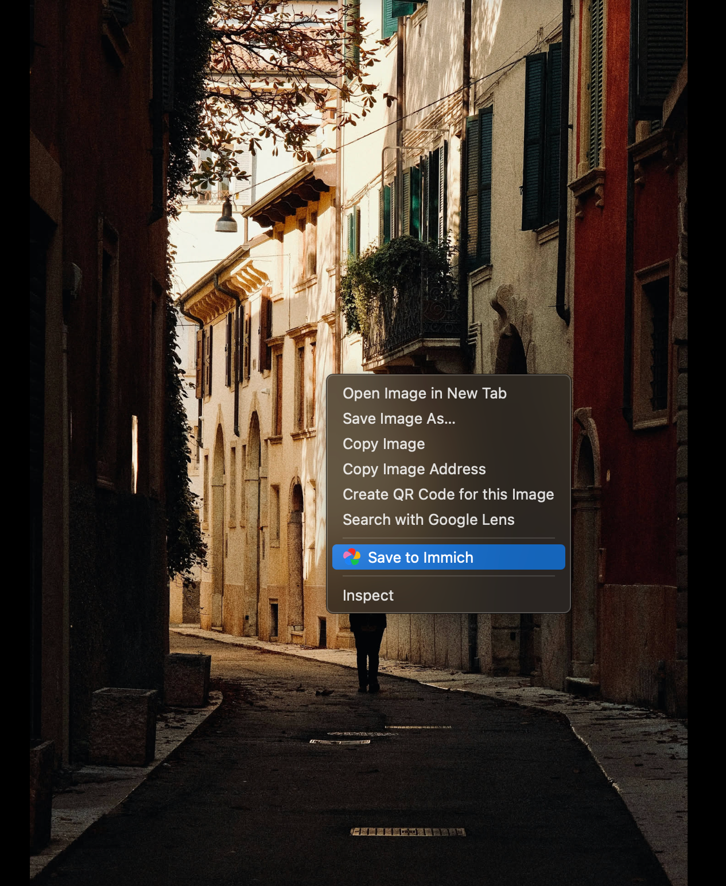

# Immich Web Clipper

A Chrome extension for saving images from the web directly to your self-hosted [Immich](https://immich.app) server.


## Features

- **Right-click to save** - Save any image to Immich via context menu
- **Album organization** - Save to a default album or choose each time
- **Statistics tracking** - Track how many images you've saved and total size
- **Dark mode** - Automatic theme matching with manual toggle
- **Duplicate detection** - Skips already-saved images (based on hash)
- **Toast notifications** - Visual feedback when saving images

## Installation

### From Chrome Web Store
*(Coming soon)*

### Manual Installation (Developer Mode)
1. Download or clone this repository
2. Open Chrome and navigate to `chrome://extensions/`
3. Enable "Developer mode" in the top right
4. Click "Load unpacked" and select the extension folder
5. The extension icon will appear in your toolbar

## Setup

1. Click the extension icon in your toolbar
2. Enter your Immich server URL (e.g., `https://immich.example.com`)
3. Enter your API key (found in Immich → Account Settings → API Keys)
4. Click "Connect"

## Usage

1. Right-click any image on a webpage
2. Select "Save to Immich" from the context menu
3. The image will be saved to your configured album



### Settings

- **Show save alerts** - Toggle toast notifications
- **Default Album** - Select which album to save images to
- **Choose album each time** - Prompt for album selection on each save
- **Reset stats** - Clear your saved images counter

## Privacy

This extension:
- Only communicates with your self-hosted Immich server
- Stores your server URL and API key locally in Chrome sync storage
- Does not collect or transmit any data to third parties
- Requires minimal permissions (only for context menus and your Immich server)

See [PRIVACY.md](PRIVACY.md) for full privacy policy.

## Development

```bash
# Clone the repository
git clone https://github.com/paradoxally/immich-web-clipper.git

# Load in Chrome
# 1. Go to chrome://extensions/
# 2. Enable Developer mode
# 3. Click "Load unpacked"
# 4. Select the cloned folder
```

### Project Structure

```
immich-web-clipper/
├── manifest.json      # Extension manifest
├── popup.html         # Popup UI
├── popup.css          # Styles (Immich design language)
├── popup.js           # Popup logic
├── background.js      # Service worker (API calls, context menu)
├── icons/             # Extension icons
│   ├── icon16.png
│   ├── icon48.png
│   ├── icon128.png
│   └── icon.svg
└── mock-preview.html  # UI preview for development
```

## Contributing

Contributions are welcome! Please feel free to submit a Pull Request.

## License

AGPL-3.0 License - see [LICENSE](LICENSE) for details.

## Acknowledgments

- [Immich](https://immich.app) - The amazing self-hosted photo management solution
- Logo and design language inspired by the official Immich project

---

**Note:** This is an unofficial community extension and is not affiliated with the Immich project.
